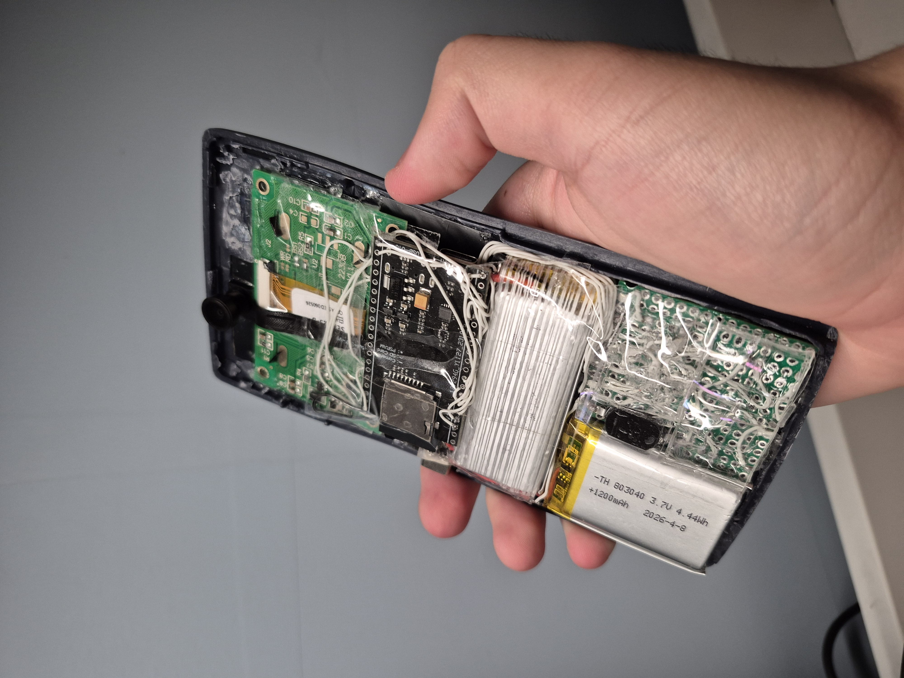
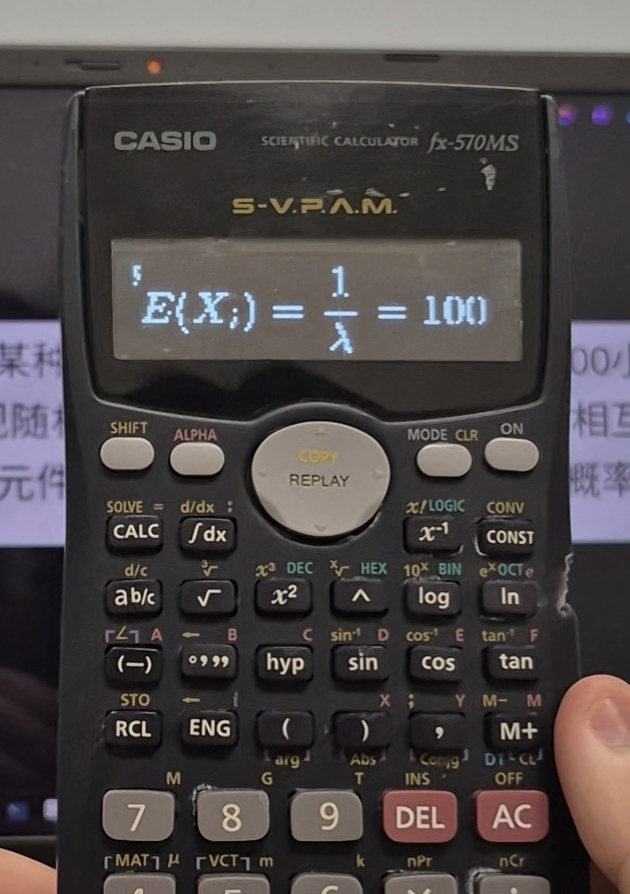
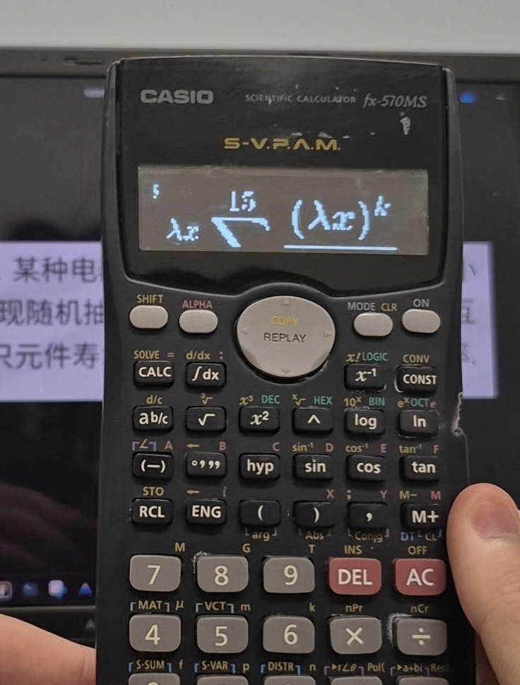

# Casio AI Machine

An ESP32-powered AI learning machine built inside a `CASIO FX-560MS` calculator body.

## What It Is

This project combines:

- `ESP32-S3`
- `OV5640 120degree` camera
- `128x32` OLED display
- custom physical buttons
- CASIO-style calculator shell

The result is a compact AI study machine that can capture question photos, send them to a server, call AI to solve them, and display readable answers on a tiny screen.

## Core Features

- Calculator-like appearance when the cover is closed.
- Single-shot solve: take one photo and submit.
- Multi-shot solve: take multiple photos and submit in one batch.
- Sidebar-style history navigation during study sessions.
- Chat-like workflow moved from desktop/mobile into calculator hardware.
- Supports mixed Chinese/English/math-symbol/LaTex content on `128x32` OLED.
- Supports LaTeX math formulas with different width/height layouts.
- Physical-key UI for up/down/left/right, confirm, capture, and page switching.
- Battery target: around `4-5 hours` of continuous use (`2700mAh`, depending on workload).

## How It Works (Architecture)

1. `ESP32` handles device workflow, input buttons, and screen interaction.
2. Server acts as the bridge between ESP32 and AI model providers.
3. Server stores photo records, solve results, and runtime logs.
4. AI Solve Layer 1 generates full step-by-step problem solutions.
5. AI Layout Layer 2 transforms the answer into display-oriented blocks (JSON).
6. Server renders formulas/text blocks into pixel data and packs them into `1-bit bitmap`.
7. ESP32 fetches and renders those blocks directly to OLED.

This design lets us display complex math, mixed-language content, and markdown-like answer structure on a very small screen.

## Quick Usage

1. Power on the device.
2. Capture one or multiple question photos.
3. Press confirm to upload.
4. Wait for AI solve + rendering pipeline.
5. Read results on-device and navigate with the hardware buttons.

## Step-by-Step Guide

For a full build + integration walkthrough, see:

- [STEP_BY_STEP.md](STEP_BY_STEP.md)

Additional project docs:

- [Things To Buy](things_to_buy.md) (includes all required materials and purchase links)
- [Circuit Diagram](circuit_diagram.md)
- [Backend Copy Notes](server/README.md)
- [AI Prompt + Harness Notes](ai_prompt_&_harness/README.md)
- [Contributing Guide](CONTRIBUTING.md)
- [Security Policy](SECURITY.md)
- [Open Source Checklist](OPEN_SOURCE_CHECKLIST.md)

## License

This repository is licensed under the MIT License.

---

## Why This Project Exists

I got tired of how much of education gets reduced to repetitive exams and homework, especially at university.
This project started as a personal rebellion: use hardware + AI as a new kind of learning magic to challenge that old exam-first workflow.

Use responsibly, learn deeply, and build better tools than the system gives us.
